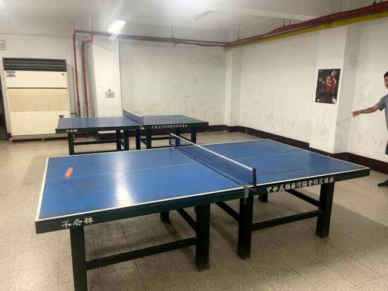
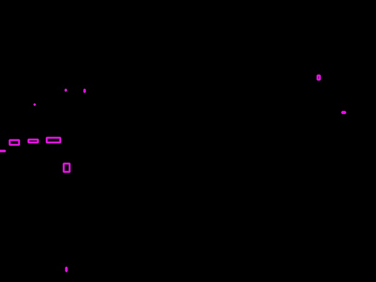
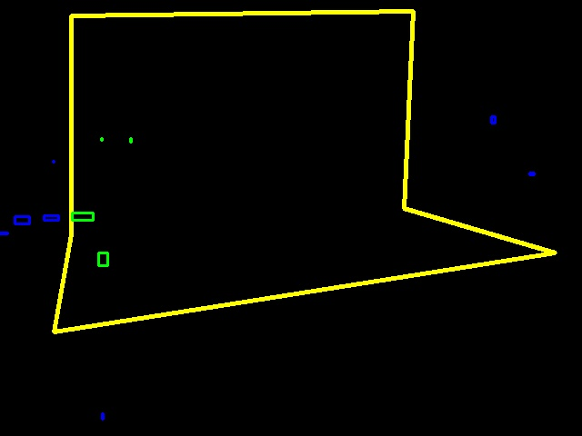
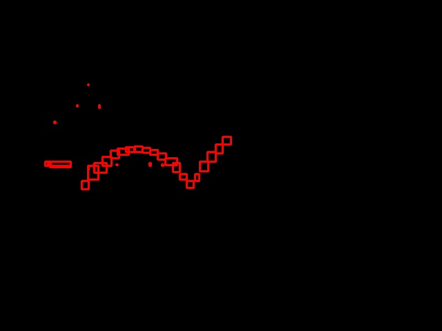
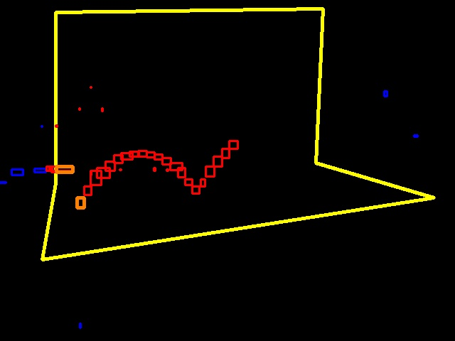
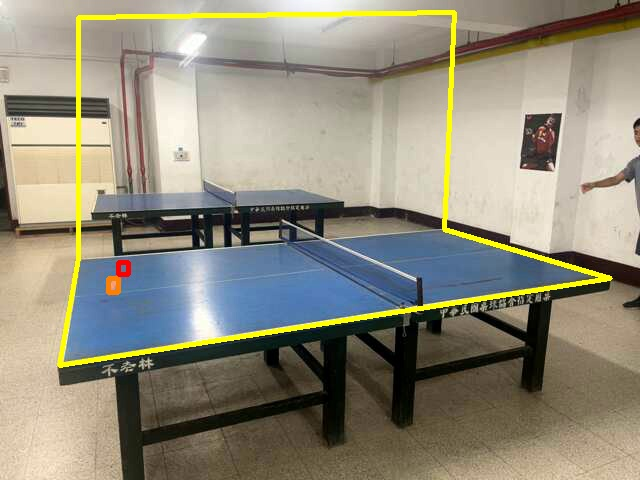

# Content

* [Introduction](#Introduction)

* [Setup & Dependencies](#Setup--Dependencies)

* [Table Tennis Detection](#Table-Tennis-Detection)

   * [Detection Process](#Detection-Process)
 
   * [Table Tennis Ball's Color Range](#Table-Tennis-Balls-Color-Range)

* [Table Tennis Prediction](#Table-Tennis-Prediction)

   * [Coordinate Transformation](#Coordinate-Transformation)

   * [Ball Simulation and Training Data Generstion](#Ball-Simulation-and-Training-DataGeneration)
 
   * [Model Training](#Model-Training)
 
* [Robotic Arm Structure and Control](#Robotic-Arm-Structure-and-Control)

  * [Hardware Structure Design](#Hardware-Structure-Design)
 
  * [Software Control](#software-Control)
 
* [System Intergration](#System-Intergration)


# Introduction

This repository is dedicated to the development of a table tennis robot. Our goal is to create a fully automated robot capable of playing ping pong with humans, leveraging the characteristics of deep learning LSTM architecture. We aim to achieve this on lower-tier, cost-effective devices. The challenge involves addressing the following tasks:


1. **Camera Localization**: Implementing camera-based localization for tracking the ping pong ball.

2. **Ping Pong Ball Detection**: Developing algorithms for detecting the ping pong ball in real-time.

3. **Trajectory Prediction Model and Training**: Building a trajectory prediction model based on LSTM.

4. **Mechanical Design and Control**: Designing the robot's mechanical components and implementing control mechanisms (using raspberrypi).

# Setup & Dependencies

***This project is mainly run on Ubuntu. Things will not perform as expected if you are not running from a Debian based OS***  
First, clone the project using git or just download the zip file and extract it. And you will have to install the nessesary python package in `requirements.txt` with pip3 or whatever you want. For example:
   ```bash
   pip3 install -r requirements.txt
   ```

# Table Tennis Detection

Detect the table tennis ball by its color, contour, and movement

## Detection Process

1. **Original frame**

<p align="center">
    
</p>

2. **Binarize with HSV color threshold**

<p align="center">
   
</p>

3. **Bounding box and merge**

<p align="center">
   
</p>

4. **Considered area**

<p align="center">
   
</p>

5. **Last 20 frames of considered data**

<p align="center">
   
</p>

6. **Newly appeared object (orange object)**

<p align="center">
   
</p>

7. **Chose the closest one to the previous result**

<p align="center">
   
</p>

## Table Tennis Ball's Color Range


# Table Tennis Prediction

Predict the ball by deep learning model.

## Coordinate Transformation

## Ball Simulation and Training data Generation

This script is designed for simulating ball data with various configurations. And save as training data files to train the ball-prediction model. It provides command-line arguments to customize simulation parameters and operations.

### Usage

#### Command-line Arguments
- **--GUI**: Enable GUI mode (default: False).
- **-l**: Length of the simulated data (default: 1000).
- **-n**: Name for the output files (default: "nb60test"), which will be stored at [/ball_simulate_v2/dataset](/ball_simulate_v2/dataset/). 
- **--mode**: Simulation mode ("default", "fit", "ne", "predict", "normal", "normalB", "normalB60", "normalBR") (default: "normalB60").
- **--merge**: Merge two datasets into one (default: False).
- **--merge_a**: File name of the first dataset to merge (default: "train.bin").
- **--merge_b**: File name of the second dataset to merge (default: "train.bin").

#### Examples
Simulate data with recommend length and name:
   ```bash
   python3 ball_simulate_v2/simulate.py -l 1000000 -n medium --mode normalBR
   ```
   In the study, we use the length of 1000000 for the medium dataset and 10000000 for the huge dataset. Meanwhile, we chose the mode `normalBR` to process the simulation as the most realistic mode.

### Modes
- **fit**: Set the simulation mode to fitting.
- **ne**: Set the simulation mode to no error.
- **predict**: Set the simulation mode to prediction.
- **normal**: Set the simulation mode to normal.
- **normalB**: Set the simulation mode to normal with additional configuration 'B'.
- **normalB60**: Set the simulation mode to normal with configuration 'B60'.
- **normalBR**: Set the simulation mode to normal with configuration 'BR'.


## Model Training

This script is designed for training and testing a ball simulation model using various configurations. The script provides command-line arguments to customize training parameters, such as learning rate, batch size, epochs, model type, and more.

### Usage

Make sure you run the code in the root of the project
   ```bash
   python3 ball_simulate_v2/train.py [args]
   ``` 

#### Command-line Arguments
- **-lr, --learning_rate**: Learning rate for the training process (default: 0.001).
- **-b, --batch_size**: Batch size for training (default: 64).
- **-e, --epochs**: Number of epochs for training (default: 30).
- **-m, --model_type**: Type of the model (default: `medium`; availible values: `small`, `medium`, `medium_var`, `big`, `large`).
- **-mom, --momentum**: Momentum for the `SGDM` optimizer (default: 0.01). **(SGDM ONLY)**
- **-d, --dataset**: Dataset name.
- **-s, --scheduler_step_size**: Step size for the learning rate scheduler (default: 0).
- **-w, --weight**: Path to the pre-trained model weight file (default: None).
- **-n, --name**: Save name for the training.
- **-o, --optimizer**: Optimizer type (default: `adam`; avalible values: `adam`, `sgdm`).
- **--num_workers**: Number of workers for data loading (default: 0). This may speed up the training. Setting to 2 is a good choice.
- **--test**: Test the model on the validation set (default: False).
- **--mode**: Training mode (`default`, `fit`, `ne`, `predict`, `normal`, `normalB`, `normalB60`, `normalBR`) (default: `normalBR`). More details can be found in [Modes](#modes) or in [/core/Constants.py](/core/Constants.py)

### Modes
- **fit**: Set the model mode to fitting.
- **ne**: Set the model mode to no error.
- **predict**: Set the model mode to prediction.
- **normal**: Set the model mode to normal.
- **normalB**: Set the model mode to normal with additional configuration 'B'.
- **normalB60**: Set the model mode to normal with configuration 'B60'.
- **normalBR**: Set the model mode to normal with configuration 'BR'.


# Robotic Arm Structure and Control

## Hardware Structure Design

## Software Control

# System Intergration
